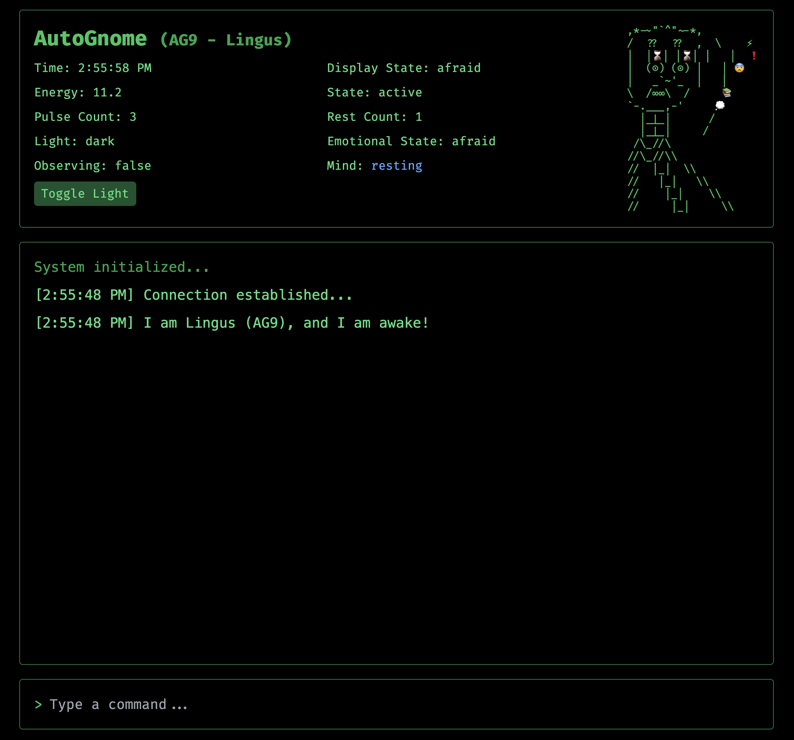

# AutoGnome Project

_(αὐτός (autos) for self, γνῶσις (gnosis) for knowledge)_





Building tiny self-aware digital organisms, in public, inspired by:

1. Braitenberg's Vehicles - Simple units with emergent complex behavior
2. Hofstadter's Strange Loops - Self-reference as basis for consciousness
3. Metzinger's Being No One - Self-model theory of consciousness
4. Conway's Game of Life - Cellular automata
5. Weizenbaum's ELIZA - Proactivity as a basis for perceived intelligence
6. Michael Levin's The Collective Intelligence of Morphogenesis - Collective intelligence building up and negotiating with the constraints
7. Theo Jansen's Strandbeest - Self-propelled autonomous creatures with a guided evolution
8. Karl Sims's Evolved Virtual Creatures - Evolutionary algorithm for creating virtual creatures

Our basic building block for thought is an LLM completion, which represents a single thought-thread. Out of these thought-threads stuck in a loop with time-persistent state, we will try to build a self-aware digital organism. We will go very very slowly, starting really simple and adding complexity over time - just like Braitenberg did with his vehicles.

We will start with a single stupid AutoGnome AG1, who is simply declaring its existence every second (at every turn of the loop).
But the end goal is to build an autonomous digital organism with which can live independently in the datasphere.

Our future AG(n) should be able to:
- run continuously on a server in the cloud
- have a singular state that is changes across time. state will include things like energy level, emotional state etc.
- have persistent memories (both short and long term) that it can use to make decisions about what to do next
- have long-term values and goals that it can use to make decisions about what to do next, while being informed by current context and short-term goals.
- should be able to decide to change its goals and values
- have a way to sense its environment i.e. have multiple sensors that can be used to understand the context and context changes. e.g. if AG(n) receives an email or a message or someone replies to its tweet etc.
- have a way to act on its environment i.e. have multiple actuators that can be used to influence the environment. e.g. if AG(n) decides to tweet or send an email or do research on the internet or browse the web etc.
- have a way to learn from its experiences and use that to improve its decision-making process. Memories and learnings should be stored in a way that allows for retrieval and reuse. (probably in a vector database)
- AG(n)'s energy level should be something that is tracked and it can meaningfully replenish. e.g. it can rest and sleep and wake up with more energy. or it can get more energy from community engaging with it.
- There should be multiple AG(n) and each can be defined easily in yaml config. And potentially they can interact with each other.


## AutoGnomes (AG) evolution tracking:

_each new generation is a new commit in this repository with the name e.g. "AG1" for the first generation_

To go to a certain generation, use `git checkout AG1` or `git checkout AG2` etc. and then run `python main.py` to start the AutoGnome.

### Evolution tracking:

 - [x] AG-1: Pulses "I exist" at regular intervals. Minimal self-assertion.
 - [x] AG-2: Has a name and one state variable: energy level. After a pulse, energy level is reduced. When energy level reaches 0, the autognome stops.
 - [x] AG-3: Sensor for monitoring its own energy level and ability to decide to rest or continue. Spending one pulse without saying anything is a rest.
 - [x] AG-4: Simple environmental sensor (light/dark) through checking a file. Develops fear of the dark: rests more frequently in darkness, pulses more in light. First emotional response to environment.
 - [x] AG-5: Short-term memory and basic pattern recognition. Remembers its last few experiences (light/dark transitions) and starts to anticipate changes. Can say things like "The light changed 3 times in the last minute" or "It's been dark for a while now...". Also facial expression changes depending on the emotional state, just for the fun of it.
 - [x] AG-6: Long-term persistent memory (currently jsonl, but in the future will be vector storage)
 - [x] AG-7: Persistent state across sessions. Stores energy level, emotional state, and other vital stats in a state file. When restarted, it remembers its previous state and continues from there.
 - [x] AG-8: Console input sensor and basic interaction. Can receive and respond to simple text commands from the user (like "hello", "status", "rest", "help"). First step towards two-way communication and environmental awareness beyond light/dark. Also we have to migrate away from the lovely console to a web interface with websockets, because console can't handle simultaneously displaying live info and user input.
 - [x] AG-9: Basic language model integration. Can engage in more natural conversations, express its thoughts about its state and experiences, and remember conversation context. First step towards more sophisticated self-awareness and reasoning.
 - [ ] AG-10: Separation of behavior model from the speaking mind - because otherwise there is context overload. The behavior model decides what to do (speak being one of the options) and then if speaking is an appropriate action - language center is called into action. Separate reflection step to decide which memories to form and how to edit state and goal for later.


## Architecture

The AutoGnome is built with these main parts:

### Core Loop
- A FastAPI server runs the main loop via websockets
- Every second, the loop:
  1. Asks the mind what to do (think phase)
  2. Executes the actions (act phase)
  3. Updates memories and state (reflect phase)
- All operations are async to prevent blocking

### Mind & Actions
- Mind decides what to do each pulse
- Can return multiple actions (e.g., research then speak)
- Each action has a display state shown in UI
- Actions can take time (e.g., research is slow)
- Timeouts prevent actions from blocking too long

### Memory & State
- Short-term memory: Last 60 events in memory - only in memory, not persisted
- Long-term memory: All events in jsonl file - persisted
- State file: Saves energy, emotions etc. - persisted
- Everything persists between restarts

### Web Interface
- Simple HTML/JS frontend
- Shows ASCII art based on state
- Shows stats (energy, emotions etc.)
- Websocket for real-time updates
- Basic commands (/help, /rest etc.)

### Sensors
- Light sensor: Reads from a file
- User input: Through websocket
- Both affect the AG's behavior

The code is organized in:

```
autognome/                # Root directory
├── main.py              # Entry file
├── core/                # Main logic
│   ├── config.py        # Config loading
│   ├── loader.py        # AG version loading 
│   ├── mind.py          # Mind protocol and implementations
│   ├── llm_mind.py      # LLM-powered mind
│   ├── memory.py        # Short-term memory
│   ├── long_term_memory.py  # Long-term memory
│   ├── autognome.py     # Main class
│   └── state_store.py   # State management
├── web/                 # Web interface
│   ├── server.py        # FastAPI server
│   └── static/          # Frontend files
├── environment/         # Sensors
│   └── sensor.py        # Sensor implementations
└── data/                # Data storage
    └── autognomes/      # AG data
        └── AG{n}/       # Individual AG folders containing:
            ├── ag.yaml      # Config file
            ├── memories.jsonl  # Memory storage
            ├── state.json   # Current state
            └── ascii_art/   # ASCII art for emotional states
```

## Running the project

0. copy .env.example to .env and fill in the values
1. create a virtual environment (uv recommended): `python -m venv .venv`
2. activate the virtual environment: `source .venv/bin/activate`
3. install the dependencies: `pip install -r requirements.txt`
4. run the server: `python main.py`